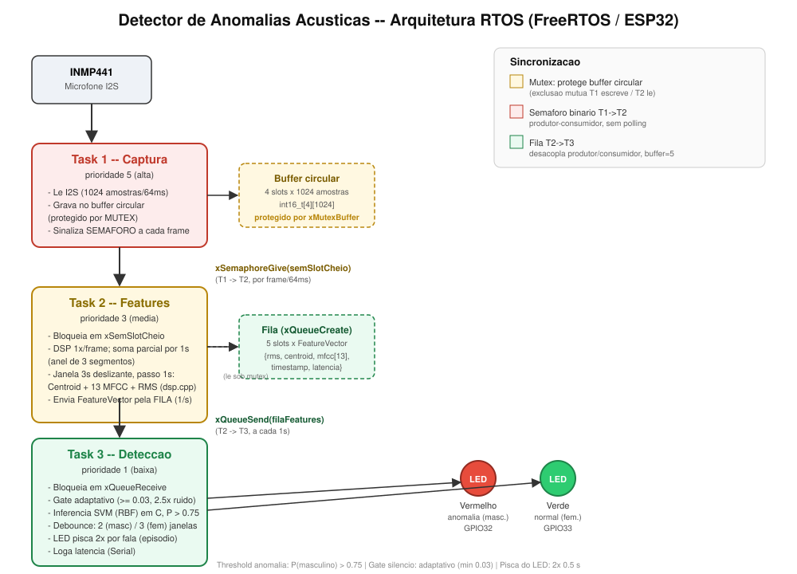

# Relatório Técnico — Detector de Anomalias Acústicas

**Disciplina/Atividade:** Ponderada — Detector de Anomalias Acústicas (ESP32 + INMP441 + FreeRTOS)

## 0. Aplicação escolhida e justificativa

**Anomalia detectada: voz masculina em um ambiente que espera apenas vozes femininas.**

Aplicação prática: monitoramento de ambientes de acesso restrito (dormitório feminino, vestiário, sala de acolhimento, banheiro/provador) onde a presença de voz masculina indica uma violação de acesso. O sistema opera em *edge computing*: o áudio é capturado, processado e classificado dentro do próprio ESP32, sem enviar áudio para a nuvem — o que também preserva a privacidade das pessoas no ambiente.

| Situação | LED |
|---|---|
| Silêncio | ambos apagados |
| Voz feminina (normal) | verde |
| Voz masculina (anomalia) | vermelho |

Diagrama RTOS completo: [`docs/diagrama_rtos.svg`](docs/diagrama_rtos.svg).

---

## 1. Arquitetura RTOS



*Diagrama de tarefas RTOS (arquivo: [`docs/diagrama_rtos.svg`](docs/diagrama_rtos.svg)).*

O firmware (`esp32/detector_anomalia/`, Arduino framework sobre FreeRTOS, ESP32-WROOM-32U) usa **3 tasks concorrentes** sincronizadas por **mutex, semáforo binário e fila** — implementação real, sem pseudocódigo.

```
INMP441 (I2S, 16 kHz)
   │
   ▼
Task 1 — Captura (prio 5, alta)
   │  grava frame de 1024 amostras no buffer circular [mutex]
   │  sinaliza "frame pronto" [semáforo binário]
   ▼
Task 2 — Features (prio 3, média)
   │  copia o frame sob mutex, alimenta o DSP em streaming;
   │  janela de 3 s deslizante, a cada 1 s: centróide + 13 MFCC + RMS      [fila]
   ▼
Task 3 — Detecção (prio 1, baixa)
      SVM RBF → decisão com debounce → LED
```

| Task | Prio. | Arquivo | Responsabilidade |
|---|---|---|---|
| 1 — Captura | 5 (alta) | `audio_capture.cpp` | Lê o I2S em blocos de 1024 amostras (64 ms), converte 24→16 bits, grava no buffer circular (4 slots) sob mutex e sinaliza o semáforo. Possui watchdog de ciclo. |
| 2 — Features | 3 (média) | `feature_task.cpp` | Bloqueia no semáforo; copia o frame sob mutex; alimenta o acumulador de DSP em streaming (`dsp.cpp`); a cada segmento de 1 s (16 000 amostras) fecha as somas parciais e, com 3 segmentos (janela de 3 s deslizante), envia um `FeatureVector` pela fila. |
| 3 — Detecção | 1 (baixa) | `detect_task.cpp` | Bloqueia na fila; gate de silêncio; inferência SVM (`svm_infer.cpp`); debounce; aciona o LED (`led_control.cpp`); registra as latências via Serial. |

### Mecanismos de sincronização

| Mecanismo | API FreeRTOS | Conecta / protege |
|---|---|---|
| Mutex | `xSemaphoreCreateMutex()` | Buffer circular compartilhado (`g_circular_buffer`, `g_ultimo_slot_pronto`, timestamp) entre Task 1 (escrita) e Task 2 (leitura) |
| Semáforo binário | `xSemaphoreCreateBinary()` | Sinaliza "frame novo" da Task 1 para a Task 2 — Task 2 dorme até haver trabalho, sem *polling* |
| Fila | `xQueueCreate(5, sizeof(FeatureVector))` | Transfere o `FeatureVector` da Task 2 para a Task 3 |

### Como os conflitos de concorrência foram resolvidos

| Risco | Solução |
|---|---|
| **Condição de corrida** no buffer circular (Task 1 escrevendo um slot enquanto a Task 2 lê) | Escrita e leitura acontecem **sob o mesmo mutex**; a Task 2 copia o frame para uma variável local (`frame_local`) dentro da seção crítica e processa **fora** dela, mantendo a seção crítica curta (uma `memcpy` de 2 KB) e a Task 1 quase nunca bloqueada. |
| **Inversão de prioridade** (Task 1, alta, esperando um mutex segurado pela Task 2, média, preemptada por outra) | O mutex do FreeRTOS implementa **herança de prioridade**; além disso, a seção crítica é mínima. |
| **Espera ocupada** | Task 2 usa semáforo e Task 3 usa fila com `portMAX_DELAY`: ambas dormem até haver dado, sem consumir CPU. |
| **Produtor mais rápido que o consumidor** | A fila usa `xQueueSend` com timeout 0; se estiver cheia, descarta o `FeatureVector` mais antigo e insere o novo (em áudio em tempo real, o dado velho vale menos que o atual) — a Task 2 nunca bloqueia. |
| **Estouro de memória** | Buffers grandes são estáticos, não ficam na pilha das tasks; o DSP em streaming usa ~8 KB em vez de guardar a janela de 3 s (187 KB, que estourava a DRAM — ver §5). |
| **Task travada** | Watchdog na Task 1: se um ciclo de captura passar de 100 ms, registra `[WATCHDOG][captura]` no Serial. |

### Por que a janela de análise é de 3 s

Testes com janelas de 1,5 s apresentaram erro sistemático (features instáveis). A Task 1 mantém o I2S contínuo, sem lacunas, em frames de 64 ms; a Task 2 roda o DSP uma vez por frame e guarda, a cada 1 s, apenas somas parciais (soma dos MFCC/centróide, contagem de frames, energia) num anel de 3 segmentos. A **janela de 3 s desliza de 1 em 1 s**: a cada segmento fechado, a Task 2 combina os últimos 3 e envia um `FeatureVector`. A média das features é idêntica à de uma janela contínua (validado em `esp32/host_test/test_dsp_stream_host.cpp`, diferença ~1e-6), e o custo de DSP não aumenta. Assim o sistema mantém 3 s de contexto estatístico e, ao mesmo tempo, decide a cada 1 s, e não a cada 3 s.

### Regras de decisão (Task 3)

1. Se `RMS da janela < 0,02` → silêncio (não roda o SVM; LEDs apagam após 1,5 s de retenção).
2. Senão roda o SVM. Uma janela é "masculina" se `P(masculino) > 0,75`.
3. **Debounce:** o LED vermelho só acende após **2 janelas consecutivas** (avaliadas a cada 1 s) classificadas como masculinas. Um erro isolado do modelo não dispara o alarme. Custo: cerca de +1 s de latência até o vermelho.
4. **Estado "incerto":** enquanto uma janela masculina ainda não foi confirmada pelo debounce, os dois LEDs ficam apagados (o log mostra `incerto`). Mostrar verde nesse intervalo afirmaria "voz feminina" sem certeza, e o início de uma fala masculina costuma cair em janelas parciais que o modelo classifica como normal.

---

## 2. Modelo de detecção

- **Modelo:** `StandardScaler` + `SVC(kernel='rbf', C=10, gamma='scale', probability=True)` (scikit-learn).
- **Features (14):** centróide espectral + 13 MFCC, calculados por **implementação própria** (FFT radix-2 de 512 pontos, 26 filtros Mel, DCT-II), idêntica em Python (`scripts/dsp_common.py`) e em C (`esp32/detector_anomalia/dsp.cpp`). Cada frame é normalizado em energia antes do MFCC e o **RMS bruto não entra no classificador** (só serve de gatilho de silêncio), porque o RMS absoluto variava demais entre dataset, microfone do notebook e INMP441.
- **Dados de treino:**
  1. `facebook/voxpopuli` (Hugging Face, streaming): 6000 clipes (3000 masculinos + 3000 femininos) cortados em janelas de 3 s. O Common Voice foi descartado por indisponibilidade.
  2. **Áudio real do INMP441** (`data/hardware/`, gravado com `esp32/audio_dump` + `scripts/08_capturar_audio_hardware.py`): 11 gravações femininas de 5 s e 3 de 30 s com fala natural (mesma pessoa), 10 masculinas de 5 s (2 locutores, reproduzidas por um celular diante do microfone) e 3 de silêncio de 5 s. Os primeiros 0,5 s de cada arquivo são descartados (transiente de partida do I2S). Além das janelas contínuas, o script `09_extrair_features_hardware.py` gera **janelas de fala parcial**: um trecho de fala misturado com silêncio real do microfone, para as duas classes, imitando o começo e o fim de frases. Os dados de hardware entram no treino com peso 20 por janela (636 janelas contra ~17 mil do voxpopuli), com as classes balanceadas dentro do hardware (há mais janelas femininas que masculinas).
- **Divisão treino/teste:** por **clipe de origem** (`GroupShuffleSplit`), evitando vazamento entre janelas do mesmo locutor.
- **Exportação:** `model/detector_genero_voz.onnx` (183 KB, `skl2onnx`) e `model/svm_params.h` (2486 vetores de suporte) para inferência nativa em C no ESP32, já que o operador `SVMClassifier` (domínio `ai.onnx.ml`) do ONNX não converte para TFLite.

---

## 3. Resultados

### 3.1 Acurácia offline (dataset voxpopuli, held-out por clipe)

```
              precision    recall  f1-score   support
    feminino       0.93      0.95      0.94      1746
   masculino       0.95      0.93      0.94      1728
    accuracy                           0.94      3474
```

### 3.2 Áudio real do INMP441 (o resultado mais relevante para a aplicação)

**Problema (domain shift).** O modelo treinado só com voxpopuli (áudio de estúdio/parlamento) falhava no hardware real: em 7 dos 11 arquivos femininos gravados pelo INMP441, a maioria das janelas foi classificada como masculina (probabilidades de 0,5 a 0,97). O microfone real e o ambiente (resposta em frequência, ruído elétrico da protoboard) mudam a distribuição das features.

**Correção.** Incluir no treino áudio capturado pelo próprio hardware (§2).

**Avaliação honesta.** Reservamos parte dos dados de hardware fora do treino (holdout): o segundo locutor masculino (`masc_06`–`masc_10`) e as femininas 9, 10, 11 e 22 (uma das gravações longas de fala natural): 217 janelas, incluindo as de fala parcial. Com o modelo treinado sem esses arquivos:

| Limiar `P(masc)` | Femininas classificadas como masculinas (falso alarme) | Masculinas perdidas |
|---|---|---|
| 0,50 (padrão do SVM) | 12 / 132 | 2 / 85 |
| 0,65 | 7 / 132 | 4 / 85 |
| **0,75 (adotado)** | **3 / 132** | 5 / 85 |
| 0,85 | 2 / 132 | 6 / 85 |
| 0,90 | 2 / 132 | 13 / 85 |

Escolhemos **0,75**: como o requisito de projeto é evitar falso alarme, aceitamos perder algumas janelas masculinas parciais. O debounce de 2 janelas (§1) reduz ainda mais o falso alarme; as detecções verdadeiras continuam, porque voz masculina contínua produz várias janelas seguidas acima do limiar.

**Ressalvas** (o teste é pequeno): (i) as femininas do holdout são da mesma pessoa que as de treino (só há uma voz feminina de hardware); (ii) as vozes masculinas foram reproduzidas pelo alto-falante de um celular, com resposta em frequência diferente da voz ao vivo; (iii) são poucas gravações no total (24 arquivos de fala). A validação definitiva é o teste ao vivo em sala.

**Observação ao vivo (Serial Monitor, versão anterior às janelas parciais e ao debounce):** a voz feminina do autor passou a ser reconhecida como normal (`prob_masc` de 0,01 a 0,15 na fala contínua), mas apareceram falsos alarmes (`prob_masc` ≈ 0,88–0,89) em janelas com fala parcial ou barulho no meio de silêncio. Esse foi o motivo direto das janelas parciais no treino, do limiar 0,75 e do debounce. 

**Teste ao vivo com o firmware final** (janela deslizante de 3 s avaliada a cada 1 s, limiar 0,75, debounce de 2 janelas e estado "incerto"; log do Serial Monitor, uma linha por segundo):
- Fala feminina contínua: 8 janelas seguidas `normal` (`prob_masc` de 0,02 a 0,24 e `seguidas=0`), com o LED verde aceso. Uma janela de início de fala chegou a `prob_masc=0,56`, abaixo do limiar, e também ficou `normal`.
- Sequência masculina: a 1ª janela acima do limiar (`prob_masc=0,97`) apareceu como `incerto` (`seguidas=1`, `led=0`, os dois LEDs apagados); **1 s depois** a 2ª janela confirmou e o LED vermelho acendeu (`ANOMALIA`, `led=2`). O alarme se manteve por 6 janelas seguidas.
- Fim da fala: uma janela de `silencio` ainda com `led=2` (retenção de 1,5 s) e em seguida `led=0`, sem oscilação entre estados.
- Silêncio: `rms` entre 0,011 e 0,019, sempre abaixo do gate de 0,02, com os LEDs apagados.
- Não houve `ANOMALIA` durante a fala feminina neste trecho.

Nas versões anteriores (janelas de 3 s disjuntas, antes do estado "incerto"), janelas isoladas com `prob_masc` de 0,81 a 0,93 chegaram a aparecer durante o teste; o debounce impedia que acendessem o vermelho (`seguidas=1`), mas o LED verde ainda acendia nessas janelas, o que motivou o estado "incerto".

---

### 3.3 Simulação do firmware sobre áudio real (`scripts/07_test_pipeline.py --cenario`)

O script de teste monta uma linha do tempo de **88 s** com gravações reais do INMP441 (silêncio, voz feminina e voz masculina alternadas) e aplica sobre ela a **mesma lógica de decisão do firmware**: janela de 3 s reavaliada a cada 1 s, gate de silêncio (0,02), limiar 0,75, debounce de 2 janelas. Usa o modelo treinado **sem** os arquivos de teste (`03_train_model.py --hardware --out-dir model/holdout`), para que o resultado seja honesto. Só as janelas totalmente dentro de um trecho feminino/silêncio contam para falso alarme (janelas que ainda contêm áudio do trecho anterior são excluídas).

| Resultado | Valor |
|---|---|
| Vozes masculinas detectadas | **4 de 5** (locutor B, reproduzido pelo celular) |
| Tempo até o alarme (do início do trecho) | média ≈ 2 s, máximo ≈ 2,5 s |
| Trechos femininos/silêncio com falso alarme | **0 de 9** (inclui 27 janelas de fala natural contínua de 30 s) |

A voz masculina não detectada (`masc_10`) é a gravação mais fraca do conjunto (RMS de janela de ~0,015–0,023, no limite do gate de silêncio de 0,02): voz masculina muito baixa ou distante cai como "silêncio". É uma limitação conhecida do gate e do volume da reprodução pelo celular. O teste é pequeno (uma voz feminina, um locutor masculino no holdout); serve como verificação funcional da lógica, não como estimativa estatística de acurácia em produção.

## 4. Latência e performance

Medições reais no ESP32 (Serial Monitor, 115200 baud). Cada linha do log traz as latências de cada etapa:

```
[deteccao] ANOMALIA prob_masc=0.97 seguidas=2 rms=0.0505 | lat_features=361464 us (max_frame=5315 us) | lat_inferencia=13036 us | lat_total=2946 ms | led=2
```

| Etapa | Medição | Fonte |
|---|---|---|
| Captura de 1 frame (1024 amostras) | **64 ms** (determinístico: 1024 / 16 000) | Física do I2S; o watchdog da Task 1 (limite 100 ms) só disparou esporadicamente, com ciclos de ~127 ms (esporádico) |
| Extração de features (DSP) | **≈ 260–470 ms de CPU por janela de 3 s** (soma de todos os `dsp_stream_push` + finalização, medido na janela deslizante); **pior caso de um frame: ≈ 13,7 ms** | `lat_features` e `max_frame`, medidos no firmware final |
| Inferência SVM (2486 vetores de suporte) | **≈ 13 ms** (13,03–13,10 ms), uma vez por segundo | `lat_inferencia`, medição direta de `svm_prob_masculino()` |
| **Latência total por janela** (início da captura → decisão do LED) | **≈ 2946–3013 ms** (medido na janela deslizante, contado do início do segmento mais antigo da janela) | `lat_total`; dominada pelos 3 s de acumulação da janela. Com a janela deslizante o mesmo intervalo de 3 s de contexto é avaliado a cada 1 s |
| Intervalo entre decisões | 1 s (janela deslizante de 3 s) | Antes: 3 s |
| Adicional do debounce | ≈ +1 s até o LED vermelho | 2 janelas consecutivas, 1 s entre elas |
| Carga de CPU do DSP | ≈ 9–16 % do tempo (0,26–0,47 s a cada 3 s de áudio) | derivada de `lat_features`; a janela deslizante não a aumenta, porque o DSP roda uma vez por frame |

**Nota sobre a medição de features.** A primeira versão do firmware media só o passo final de `dsp_stream_finalizar` (~10 µs), o que subestimava o custo real, já que a FFT/MFCC roda espalhada nos `dsp_stream_push` durante os 3 s. O firmware atual acumula o tempo de **todos** os `push` da janela (`lat_features`) e registra o pior caso de um único frame (`max_frame`). O critério de tempo real é `max_frame` < 64 ms: com **13,7 ms** medidos, a Task 2 processa um frame em ~21 % do tempo que o próximo leva para chegar, ou seja, acompanha a captura com folga de ~4,7×, sem perder frames. A variação de `lat_features` entre janelas (≈ 230–550 ms) vem do número de frames com energia acima do gate por frame: janelas com mais silêncio custam menos. Referência de software (CPU de notebook, `scripts/07_test_pipeline.py`, 78 janelas): extração ≈ 46 ms por janela de 3 s (p95 71 ms) e inferência ONNX ≈ 0,8 ms. O ESP32 gasta ≈ 260–470 ms de CPU de DSP por janela de 3 s e ≈ 13 ms de inferência, ou seja, é cerca de 6 a 10 vezes mais lento na extração e ~15 vezes na inferência, como esperado para um Xtensa a 240 MHz sem otimização SIMD.

**Interpretação.** O contexto de 3 s por decisão é escolha deliberada de projeto: dá estabilidade às features. Com janelas não sobrepostas isso significava uma decisão a cada 3 s, e falas curtas podiam terminar antes da confirmação do debounce. A janela deslizante (decisão a cada 1 s) resolve isso sem perder o contexto. O processamento em si (DSP + SVM ≈ 13 ms a cada 1 s) é uma pequena fração do intervalo.

---

## 5. Discussão

### O que funcionou bem
- Implementar o DSP do zero, idêntico em Python e C, permitiu validar numericamente o firmware no computador antes de ir ao hardware (§6).
- O SVM RBF sobre centróide + MFCC é leve o suficiente para o ESP32 (~13 ms por inferência, modelo na flash).
- Separar captura (64 ms), features (3 s) e decisão em tasks com prioridades distintas manteve o I2S contínuo mesmo durante o cálculo do DSP e a inferência.

### Erros encontrados e corrigidos (documentados propositalmente)

1. **Descompasso de janela treino vs. inferência.** O primeiro modelo foi treinado com a média de features do clipe inteiro (~10 s) e testado ao vivo com janelas de 1,5 s, causando erro sistemático. Corrigido treinando com a mesma janela de 3 s usada na inferência, com divisão por clipe.
2. **Bug de sinal no Platt scaling.** A implementação em C usava `exp(decisão·probA + probB)`; o correto é `exp(decisão·probA − probB)`. Encontrado comparando termo a termo com `predict_proba()` do sklearn.
3. **Estouro de DRAM (~110 KB) no ESP32.** Guardar a janela de 3 s em `float[48000]` (187 KB) não cabia. Reescrevemos o DSP em modo streaming (~8 KB), validado bit a bit contra a versão em lote (`esp32/host_test/test_dsp_stream_host.cpp`). O mesmo tipo de estouro reapareceu no sketch de captura de áudio (buffer de 160 KB) e foi resolvido transmitindo em blocos.
4. **Watchdog disparando em todo ciclo.** O limite inicial de 50 ms era menor que o mínimo físico de 64 ms para ler 1024 amostras a 16 kHz; ajustado para 100 ms.
5. **RMS absoluto não generaliza entre microfones.** O RMS observado no INMP441 ficou acima da distribuição de treino (o notebook havia ficado abaixo). Corrigido normalizando a energia de cada frame e removendo o RMS bruto do classificador (acurácia offline 93% → 94%).
6. **LEDs com lógica invertida** (ficavam acesos em repouso e apagavam ao detectar). Era fiação ativa-em-LOW (anodo no 3,3 V). Em vez de compensar no código, corrigimos fisicamente a fiação, mantendo a lógica convencional (`HIGH` = aceso). Um GPIO defeituoso (GPIO2) foi trocado pelo GPIO33 depois de um teste isolado de piscar os LEDs, que mostrou que o defeito estava naquela posição da protoboard.
7. **Limiar de silêncio calibrado com o dataset, não com o hardware.** `0,01` (dataset) nunca detectava silêncio real; depois `0,05` tratava fala como silêncio. Calibrado com áudio do INMP441 (silêncio ≈ 0,005; fala em janela de 3 s entre ≈ 0,015 e 0,08) para `0,02`.
8. **Domain shift dataset → INMP441** (§3.2): o erro mais grave. Corrigido com áudio real do hardware, janelas de fala parcial, limiar de decisão 0,75 e debounce.
9. **Apito de partida nas gravações.** O I2S produz um bloco constante nos primeiros ~0,3 s. Descartado no firmware de captura e cortado (0,5 s) no pipeline de treino.

### Limitações conhecidas
- **Pouca variedade de vozes no hardware:** uma voz feminina e dois locutores masculinos (por reprodução em celular). O desempenho com outras pessoas pode ser pior; mais locutores gravados direto no microfone melhorariam o modelo.
- **Escopo fechado (binário):** o sistema distingue voz masculina de feminina; música, ruído ou vozes infantis são forçados a uma das duas classes, sem noção de "não sei". O gate de silêncio e o debounce mitigam, mas não eliminam isso.
- **Trade-off falso alarme vs. detecção:** limiar 0,75 e debounce reduzem falsos alarmes ao custo de perder algumas detecções e de ~1 s de atraso adicional. As janelas deslizantes consecutivas compartilham 2/3 do áudio, então o debounce de 2 janelas é menos independente do que era com janelas disjuntas (um ruído longo pode gerar duas janelas seguidas). É uma escolha consciente para uma aplicação em que alarme falso recorrente desacredita o sistema.
- **Semáforo binário coalesce sinalizações:** se a Task 2 atrasar mais de um frame, sinalizações se fundem e a task lê apenas o último slot pronto. Isso é seguro enquanto o DSP de um frame (`max_frame`) for menor que 64 ms (§4); o buffer circular de 4 slots dá folga de 256 ms para picos.

---

## 6. Validação numérica C vs. Python

O DSP e a inferência foram validados no computador (compilados com `g++`, sem Arduino) contra as implementações Python usadas no treino:

| Componente | Método | Resultado |
|---|---|---|
| `dsp.cpp` (FFT + MFCC, API em lote) | `esp32/host_test/test_dsp_host` vs `dsp_common.py` | Diferença ~1e-6 (float32 vs float64) |
| `dsp.cpp` (API streaming) | `esp32/host_test/test_dsp_stream_host` vs API em lote | Idêntica bit a bit |
| `svm_infer.cpp` (SVM + Platt) | `esp32/host_test/test_svm_host` vs `predict_proba()` | Diferença ~0,001–0,002 após a correção do sinal |

---

## 7. Como reproduzir

```
pip install -r requirements.txt
python scripts/01_prepare_dataset.py         # baixa e prepara o voxpopuli
python scripts/02_extract_features.py        # features do voxpopuli
python scripts/09_extrair_features_hardware.py   # features do áudio do INMP441 (data/hardware/)
python scripts/03_train_model.py --hardware --hw-final --hw-weight 20   # treina e exporta o .onnx
python scripts/04b_export_svm_header.py      # gera model/svm_params.h
cp model/svm_params.h esp32/detector_anomalia/svm_params.h
python scripts/07_test_pipeline.py           # janelas do voxpopuli: acurácia funcional + latência (Python)
python scripts/03_train_model.py --hardware --out-dir model/holdout   # modelo sem os arquivos de teste
python scripts/07_test_pipeline.py --cenario --model model/holdout/detector_genero_voz.onnx   # simula o firmware sobre áudio real
```

Para coletar áudio do hardware: gravar `esp32/audio_dump/audio_dump.ino` no ESP32 e rodar
`python scripts/08_capturar_audio_hardware.py --port /dev/ttyUSB0 --out data/hardware/fem_XX.wav`
(prefixos `fem_`, `masc_` e `sil_`).

Firmware final: abrir `esp32/detector_anomalia/detector_anomalia.ino` no Arduino IDE (placa ESP32 Dev Module), compilar e gravar. Pinagem: I2S SCK=26, WS=25, SD=27; LED verde=GPIO33, LED vermelho=GPIO32.

---

## 8. Entregáveis do enunciado

| Entregável | Onde está |
|---|---|
| Repositório com o código-fonte | `esp32/detector_anomalia/` (firmware), `scripts/` (pipeline Python) |
| Diagrama de tarefas RTOS (tasks, mutex, semáforo, fila, sincronização) | [`docs/diagrama_rtos.svg`](docs/diagrama_rtos.svg) |
| Modelo de detecção (.onnx) | `model/detector_genero_voz.onnx` |
| Relatório técnico (arquitetura RTOS, latência, resultados, discussão) | Este documento (§1, §4, §3, §5) |
| Código de teste (simula anomalias e mede performance) | `scripts/07_test_pipeline.py` (modo padrão: acurácia funcional e latência; modo `--cenario`: simula o firmware sobre áudio real com anomalias), §3.3; validação em C em `esp32/host_test/` |

Requisitos: captura contínua via ESP32 + INMP441 (§1); detecção com modelo pré-treinado (§2); mínimo de 3 tasks sincronizadas (§1); latência por etapa medida e documentada (§4); alerta por LED (§1); resolução de concorrência (§1).

## 9. Estrutura do repositório

```
├── scripts/                      Pipeline Python
│   ├── 01_prepare_dataset.py         dataset voxpopuli
│   ├── 02_extract_features.py        features do voxpopuli
│   ├── 03_train_model.py             treino + export .onnx (opção --hardware)
│   ├── 04b_export_svm_header.py      SVM → header C (inferência em C no ESP32)
│   ├── 07_test_pipeline.py           simula anomalias (--cenario) e mede performance
│   ├── 08_capturar_audio_hardware.py captura áudio do INMP441 pela serial
│   ├── 09_extrair_features_hardware.py  features do áudio de hardware
│   └── dsp_common.py                 extração de features (fonte da verdade)
├── esp32/
│   ├── detector_anomalia/        Firmware final (3 tasks FreeRTOS)
│   ├── audio_dump/               Captura de áudio para treino
│   └── host_test/                Validação numérica C vs. Python
├── model/                        .onnx, svm_params.h, pipeline.joblib
├── data/hardware/                Áudios gravados pelo INMP441
├── docs/diagrama_rtos.svg
└── README.md                     Este documento (relatório técnico)
```
